# Alpha-02 模块 — 开发文档

> **模块**: `Project-Alpha-02/`  
> **职责**: 复现招商证券《多模型集成量价Alpha策略》(2023)，MLP/GBDT/GRU/AGRU 四模型 ICIR 加权集成  
> **项目定位**: Alpha-02，Project-Alpha 的延续与扩展（非替代/迭代），聚焦量价原始特征路线  
> **依赖**: PyTorch(cu124), LightGBM 4.6+, scipy, pandas  
> **创建**: 2026-06-25  
> **最后更新**: 2026-06-28 — 项目名称修正(Alpha-02)+Git初始化准备+文档更新

---

## 0. 变更日志

| 版本 | 日期 | 变更内容 |
|------|------|----------|
| v1.0 | 2026-06-25 | 初始版本 — 项目骨架搭建完成，4模型+双Dataset+滚动训练+ICIR集成 |
| v1.1 | 2026-06-26 | 路线A P2/P3全部完成 — 滚动训练+ICIR集成+相关性+分组回测+Notebook |
| v1.2 | 2026-06-26 | 路线B切换 — 180维量价特征+VWAP 10天标签+MSE，配置/文档全量更新 |
| v1.3 | 2026-06-26 | **路线B P2/P3全部完成** — 滚动训练+ICIR集成+相关性+分组回测+Notebook+路线A对比 |
| v1.4 | 2026-06-28 | **项目名称修正(Alpha-02)** + Git初始化准备 + 文档同步更新 + 推送清单确认 |

### v1.0 详细

- 完整项目目录结构（8个模块目录）
- `config.py` — 论文表2-5参数全局配置
- `utils/` — 数据加载/特征工程/预处理/Dataset/评估/相关性分析
- `models/` — MLP(180维)/GBDT(180维)/GRU(30步序列)/AGRU(GRU+Attention)
- `train.py` — PyTorch 和 GBDT 双轨训练（single/rolling 两种模式）
- `evaluate.py` — RankIC/ICIR/20组分组回测
- `ensemble.py` — 滚动 ICIR 加权 Voting
- 复用 Project-Alpha 的 OHLCV 数据，VWAP = amount/volume 近似计算

### v1.4 详细

- **项目正式定名为 Alpha-02**：澄清定位——Alpha-02 是 Project-Alpha 的延续与扩展，非替代/迭代；聚焦量价原始特征路线（路线B = 论文二核心）
- **Git 仓库初始化准备**：确定推送/忽略清单，生成 `.gitignore`
- **开发文档同步更新**：
  - 全文"Project-Beta"→"Alpha-02"名称修正
  - 附录 A 目录结构标注各文件入库/不入库状态
  - 附录 B/附录 D 表头同步修正
- **GUIDE.md 不入库**：确认为 CB 内部编程上下文，仅本地使用
- **路线A+路线B 全流程已闭环**：P0→P1→P2→P3→Notebook 完整交付

---

## 1. 模块架构总览

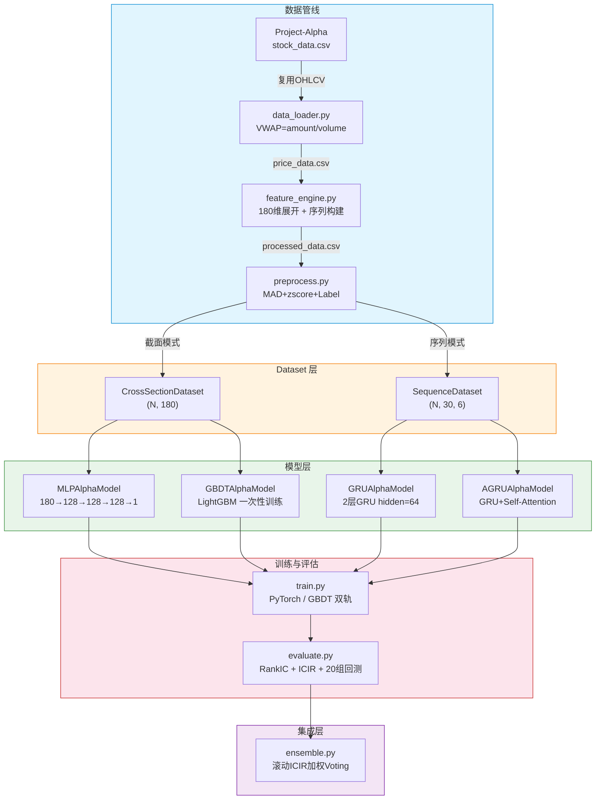

### 设计原则

1. **截面不可拆分**: DataLoader `batch_size=1`，每个 batch = 一个交易日所有股票，保证 BatchNorm 和 IC 计算的正确性
2. **时间严格划分**: 所有 split 按时间顺序，10天 buffer 防信息泄露，严禁随机 split
3. **双轨训练**: PyTorch 模型（MLP/GRU/AGRU）逐截面 batch 训练，GBDT 拼接全部截面一次性训练
4. **滚动窗口**: 6个扩展窗口（W0-W5），每半年重新训练一次
5. **3种子平均**: 每个模型用3个随机种子训练，测试集取平均

### 图例

| 颜色 | 层级 | 说明 |
|------|------|------|
| 蓝 | 数据管线 | 原始数据 → 特征 → 预处理 |
| 橙 | Dataset 层 | 截面/序列两种数据封装 |
| 绿 | 模型层 | 4种模型架构 |
| 红 | 训练/评估 | 训练循环 + 评估指标 |
| 紫 | 集成层 | ICIR 加权 Voting |

---

## 2. 组件清单

### 核心文件

| 文件 | 主要类/函数 | 职责 |
|------|------------|------|
| `config.py` | 全局常量 | 路径/股票池/模型超参/训练参数 |
| `losses.py` | `mse_loss`, `ic_loss`, `ccc_loss` | 损失函数（论文默认MSE） |
| `train.py` | `train_pytorch_model`, `train_gbdt_model`, `train_single`, `train_rolling` | 训练入口 |
| `evaluate.py` | `evaluate_model` | 评估入口 |
| `ensemble.py` | `icir_weighted_voting`, `build_ensemble_predictions`, `compute_rolling_icir` | ICIR 加权集成 |

### utils/

| 文件 | 主要类/函数 | 职责 |
|------|------------|------|
| `data_loader.py` | `load_alpha_data`, `compute_vwap` | 从 Project-Alpha 复用 OHLCV，计算 VWAP |
| `feature_engine.py` | `build_cross_section_features`, `build_sequence_data`, `build_vwap_return_label` | 180维展开 + 序列构建 + VWAP 标签 |
| `preprocess.py` | `mad_clip_section`, `zscore_section`, `preprocess_price_data` | MAD 去极值 + zscore 标准化 |
| `dataset.py` | `CrossSectionDataset`, `SequenceDataset`, `split_dataset` | 双模式 Dataset + 时序划分 |
| `metrics.py` | `rank_ic`, `calc_ic_series`, `ic_summary`, `group_return` | RankIC/ICIR/分组回测 |
| `correlation.py` | `model_cross_section_correlation`, `max_ic_correlation` | 模型间相关性分析 |

### models/

| 文件 | 类 | 输入 | 架构 | 参数量 |
|------|-----|------|------|--------|
| `mlp_alpha.py` | `MLPAlphaModel` | (N, 180) | 3层128, Sigmoid, BN, Dropout=0.05 | ~72K |
| `gbdt_alpha.py` | `GBDTAlphaModel` | (N, 180) | LightGBM, max_depth=64, num_leaves=512 | 动态 |
| `gru_alpha.py` | `GRUAlphaModel` | (N, 30, 6) | 2层GRU(hidden=64), Dropout=0.1 | ~50K |
| `agru_alpha.py` | `AGRUAlphaModel` | (N, 30, 6) | GRU + Self-Attention + FC(128,1) | ~58K |

---

## 3. 数据模型

### 3.1 数据流转 ER 图

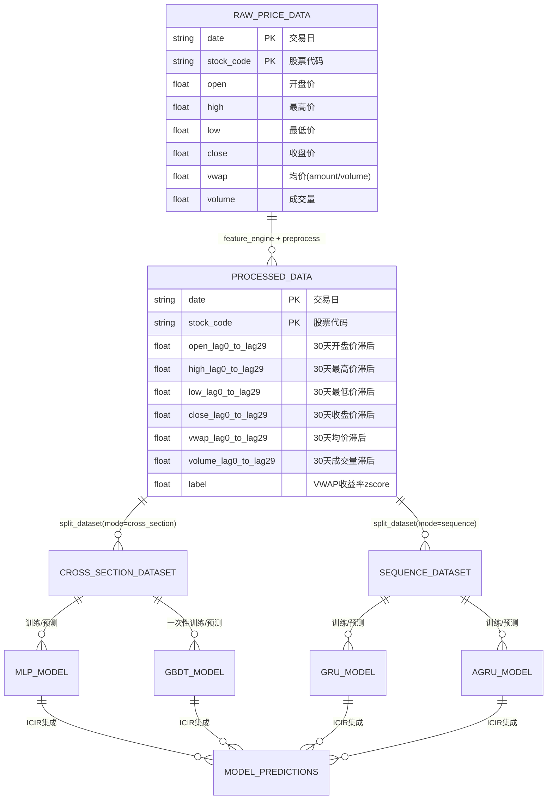

### 3.2 关键数据结构

| 结构 | 格式 | 说明 |
|------|------|------|
| `price_data.csv` | (N_rows, 8) | 原始日线量价，6字段 + date + stock_code |
| `processed_data.csv` | (N_rows, 2+180+1) | 展开后截面数据，180维_lag + label |
| `sequences` dict | `{code: ndarray(n_days, 30, 6)}` | 预构建的序列数据，仅 GRU/AGRU 使用 |
| `CrossSectionDataset` | 每样本 `(M, 180), (M,)` | M = 当日截面股票数，每个样本一个交易日 |
| `SequenceDataset` | 每样本 `(M, 30, 6), (M,)` | M = 当日截面股票数 |
| `checkpoint` | `.pt` (PyTorch) / `.joblib` (GBDT) | 模型权重文件 |

### 3.3 论文参数对照表（路线B：量价路线）

| 参数 | config 变量 | 论文出处 | 当前值（路线B） |
|------|------------|----------|-----|
| 量价字段 | `PRICE_FIELDS` | §2.1 | ["open","high","low","close","vwap","volume"] |
| 序列长度 | `SEQUENCE_LENGTH` | 表2 | 30 |
| 标签周期 | `LABEL_PERIOD` | §2.1 | 10 (T+1到T+11 VWAP收益) |
| 标签类型 | `LABEL_TYPE` | §2.1 | "vwap" |
| MAD 倍数 | `MAD_MULTIPLIER` | 表2 | 3 |
| MLP 隐藏层 | `MLP_HIDDEN_DIMS` | 表3 | (128, 128, 128) |
| MLP Dropout | `MLP_DROPOUT` | 表3 | 0.1 |
| MLP LR | `MLP_LR` | 表3 | 0.001 |
| GBDT 学习率 | `LGBM_LR` | 表4 | 0.1 |
| GBDT 最大深度 | `LGBM_MAX_DEPTH` | 表4 | 7 |
| GBDT 叶子数 | `LGBM_NUM_LEAVES` | 表4 | 127 |
| GBDT 最小样本 | `LGBM_MIN_DATA_IN_LEAF` | 表4 | 512 |
| GBDT 树数 | (n_estimators) | 表4 | 500 |
| GRU 隐状态 | `GRU_HIDDEN_DIMS` | 表5 | 64 |
| GRU 层数 | `GRU_NUM_LAYERS` | 表5 | 2 |
| GRU Dropout | `GRU_DROPOUT` | 表5 | 0.1 |
| 损失函数 | `LOSS_FN` | §2.1 | "mse" |
| ICIR 窗口 | `ICIR_WINDOW` | §2.3 | 60 |
| 防泄露 buffer | `BUFFER_DAYS` | 表2 | 10 |
| 随机种子 | `RANDOM_SEEDS` | §2.1 | [42, 123, 456] |
| 分组数 | `N_GROUPS` | §2.2 | 20 |

---

## 4. 详细数据流

### 4.1 数据加载流水线

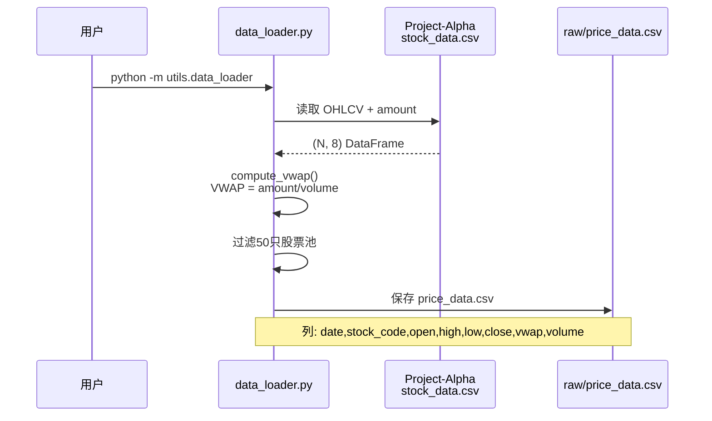

### 4.2 特征工程流水线

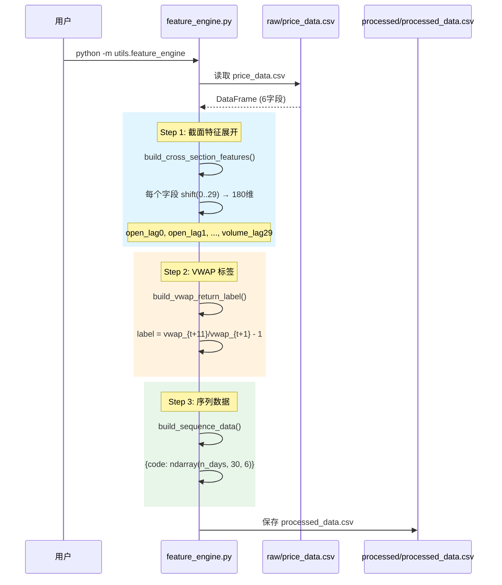

### 4.3 预处理流水线

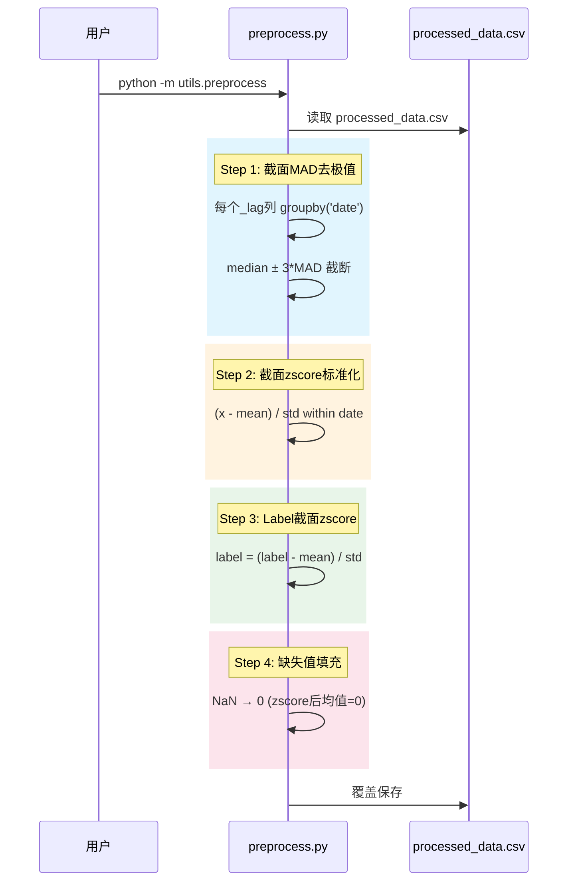

### 4.4 PyTorch 模型训练循环

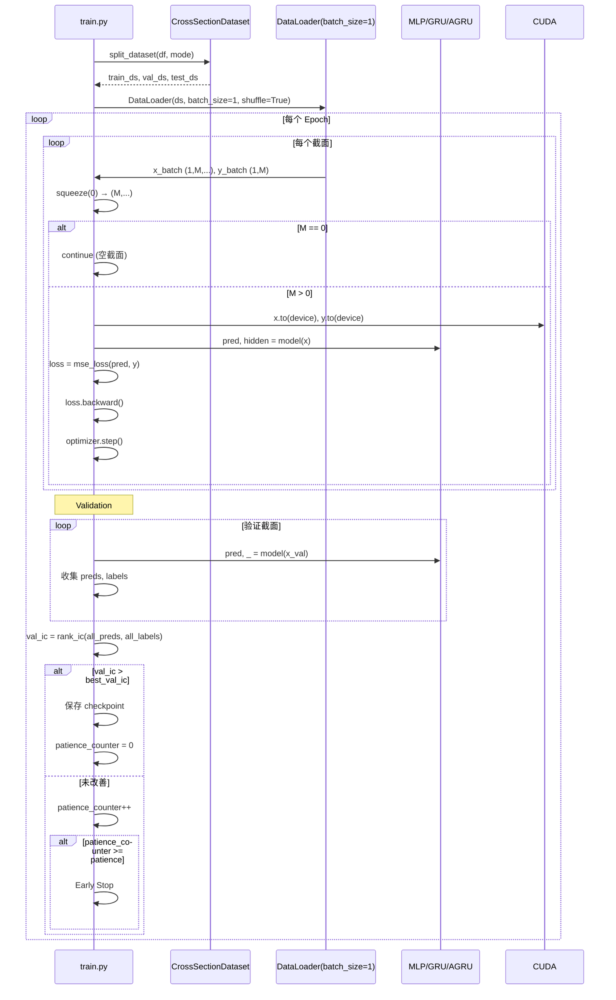

### 4.5 GBDT 训练流程（非 PyTorch）

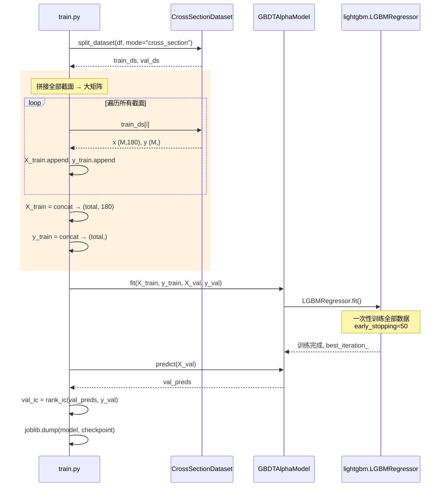

### 4.6 ICIR 加权集成

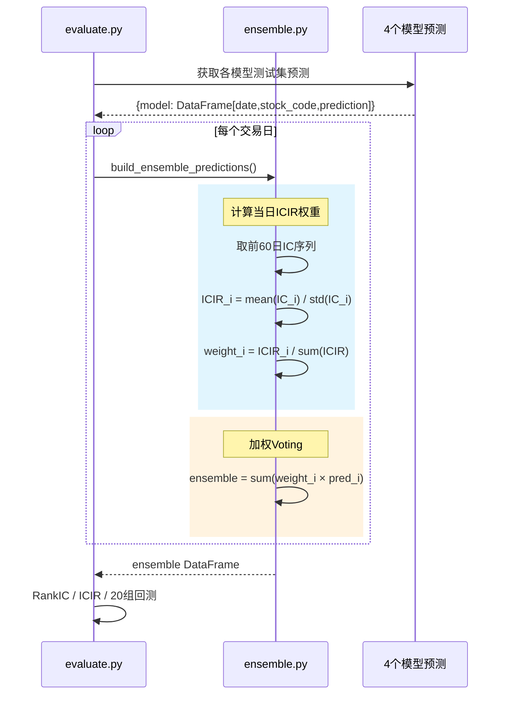

---

## 5. API 设计

### 5.1 CLI 入口

| 命令 | 说明 |
|------|------|
| `python -m utils.data_loader` | 从 Alpha 复用数据，计算 VWAP，保存到 data/raw/ |
| `python -m utils.feature_engine` | 180维展开 + VWAP标签 + 序列构建，保存 processed_data.csv |
| `python -m utils.preprocess` | MAD去极值 + zscore 标准化 |
| `python train.py --mode single --model mlp` | 训练单个 MLP 模型 |
| `python train.py --mode single --model gbdt` | 训练单个 GBDT 模型 |
| `python train.py --mode single --model gru` | 训练单个 GRU 模型 |
| `python train.py --mode single --model agru` | 训练单个 AGRU 模型 |
| `python train.py --mode rolling` | 4模型 × 6窗口 × 3种子 滚动训练 |
| `python evaluate.py --model mlp` | 评估 MLP 模型 |
| `python evaluate.py --model gbdt` | 评估 GBDT 模型 |

### 5.2 Python API

#### Dataset 层

```python
from utils.dataset import CrossSectionDataset, SequenceDataset, split_dataset

# 截面模式（MLP/GBDT）
train_ds, val_ds, test_ds = split_dataset(df, mode="cross_section")

# 序列模式（GRU/AGRU）
train_ds, val_ds, test_ds = split_dataset(df, mode="sequence", sequences=seqs)
```

#### 模型层

```python
from models import MLPAlphaModel, GBDTAlphaModel, GRUAlphaModel, AGRUAlphaModel

# PyTorch 模型统一接口
mlp = MLPAlphaModel(n_factors=180)
pred, hidden = mlp(x)  # x: (N, 180), pred: (N,), hidden: (N, 128)

gru = GRUAlphaModel()
pred, hidden = gru(x)  # x: (N, 30, 6), pred: (N,), hidden: (N, 64)

# GBDT 非 PyTorch 接口
gbdt = GBDTAlphaModel()
gbdt.fit(X_train, y_train, X_val, y_val)
pred = gbdt.predict(X_test)  # numpy array
```

#### 评估层

```python
from utils.metrics import rank_ic, calc_ic_series, ic_summary, group_return

ic = rank_ic(predictions, actuals)                     # 单截面 RankIC
ic_series = calc_ic_series(preds, actuals, dates)      # 日频 IC 序列
stats = ic_summary(ic_series)                           # {rank_ic_mean, icir, ic_win_rate}
groups = group_return(df, n_groups=20)                 # 20组分组回测
```

#### 集成层

```python
from ensemble import icir_weighted_voting, build_ensemble_predictions

# 单次加权
ensemble = icir_weighted_voting(model_preds, model_icirs)

# 逐日滚动加权
ensemble_df = build_ensemble_predictions(model_pred_df, ic_history)
```

---

## 6. 配置管理

### 6.1 配置注册

所有配置集中在 `config.py`，使用 `Final` 类型标注防止意外修改：

```python
from typing import Final
from pathlib import Path

PROJECT_ROOT: Final = Path(__file__).resolve().parent
RAW_DATA_DIR: Final = PROJECT_ROOT / "data" / "raw"
PROCESSED_DATA_DIR: Final = PROJECT_ROOT / "data" / "processed"
CHECKPOINT_DIR: Final = PROJECT_ROOT / "checkpoints"
LOG_DIR: Final = PROJECT_ROOT / "logs"
```

### 6.2 配置分组

| 配置组 | 变量前缀 | 示例 |
|--------|----------|------|
| 路径 | `*_DIR`, `ALPHA_*` | `RAW_DATA_DIR`, `ALPHA_STOCK_DATA` |
| 股票池 | `STOCK_POOL` | 50只 A 股代码列表 |
| 时间 | `DATE_RANGE`, `TRAIN_END`, `VAL_END` | 2018-2023 |
| 数据字段 | `PRICE_FIELDS`, `SEQUENCE_LENGTH`, `N_FEATURES` | 6字段, 30天 |
| MLP | `MLP_*` | LR=0.001, Hidden=(128,128,128) |
| GBDT | `LGBM_*` | LR=0.01, max_depth=64 |
| GRU | `GRU_*` | LR=0.001, hidden=64, layers=2 |
| AGRU | `AGRU_*` | 同 GRU 参数 |
| 预处理 | `MAD_MULTIPLIER`, `FILLNA_VALUE` | 3, 0 |
| 集成 | `ICIR_WINDOW` | 60 |
| 训练 | `RANDOM_SEEDS`, `BUFFER_DAYS`, `N_GROUPS` | [42,123,456], 10, 20 |
| 滚动窗口 | `ROLLING_WINDOWS` | 6个 (train_end, val_end, test_end) 元组 |

### 6.3 滚动训练窗口配置

```python
ROLLING_WINDOWS: Final = [
    ("2019-12-31", "2020-12-31", "2021-06-30"),  # W0: 训练到2019底
    ("2020-06-30", "2021-06-30", "2021-12-31"),  # W1: 训练到2020中
    ("2020-12-31", "2021-12-31", "2022-06-30"),  # W2
    ("2021-06-30", "2022-06-30", "2022-12-31"),  # W3
    ("2021-12-31", "2022-12-31", "2023-06-30"),  # W4
    ("2022-06-30", "2023-06-30", "2023-12-31"),  # W5
]
# 每个窗口: (train_end, val_end, test_end)
# train: date < train_end - 10天
# val:   train_end+10 <= date < val_end-10
# test:  date >= val_end+10
```

---

## 7. 模型架构矩阵

### 7.1 架构对比

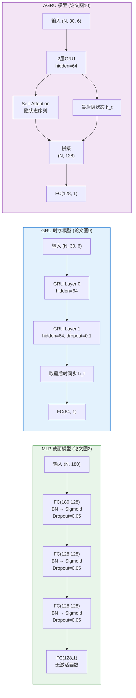

### 7.2 关键设计决策

| 决策 | 原因 | 论文依据 |
|------|------|----------|
| MLP 末层无 ReLU | 标签 zscore 有负值，ReLU 杀负预测 | Project-Alpha 已踩坑 |
| MLP 用 Sigmoid 而非 ReLU | 论文图2 明确标注 Sigmoid | §1.1 |
| GBDT 不用 DataLoader | GBDT 在函数空间迭代，非梯度下降 | §1.2 |
| GRU 取最后隐状态 | 标准做法，论文图9 | §1.3 |
| AGRU Attention 取平均 | 简化 Self-Attention，论文未详细说明 | 图10 |
| batch_size=1 | 截面不可拆分，BatchNorm 需截面内计算 | §2.1 |
| 3种子平均 | 论文 §2.1 明确要求 | §2.1 |

---

## 8. 数据划分策略

### 8.1 时间划分（防信息泄露）

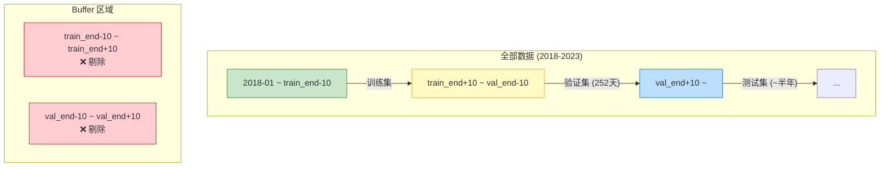

### 8.2 滚动窗口示意图

```mermaid
flowchart TD
    subgraph W0["W0: 训练至 2019-12-31"]
        direction LR
        W0T["训练: 2018-01 ~ 2019-12-21"] --> W0V["验证: 2020-01-10 ~ 2020-12-21"]
        W0V --> W0E["测试: 2021-01-10 ~ 2021-06-30"]
    end

    subgraph W1["W1: 训练至 2020-06-30"]
        direction LR
        W1T["训练: 2018-01 ~ 2020-06-20"] --> W1V["验证: 2020-07-10 ~ 2021-06-20"]
        W1V --> W1E["测试: 2021-07-10 ~ 2021-12-31"]
    end

    subgraph W5["W5: 训练至 2022-06-30"]
        direction LR
        W5T["训练: 2018-01 ~ 2022-06-20"] --> W5V["验证: 2022-07-10 ~ 2023-06-20"]
        W5V --> W5E["测试: 2023-07-10 ~ 2023-12-31"]
    end

    style W0 fill:#e8f5e9,stroke:#388e3c
    style W1 fill:#fff3e0,stroke:#f57c00
    style W5 fill:#e3f2fd,stroke:#1976d2
```

**关键规则**：
- 扩展窗口：训练集随时间推移长度增加
- 验证集固定 252 个交易日
- 测试集约半年
- 相邻边界各剔除 10 天

---

## 9. 演进路线

### 当前状态 (v1.4 — 路线A+路线B 全流程完成，项目定名Alpha-02)

```
✅ 路线A P2：4模型×6窗口×3种子滚动训练 (Mean Val IC: MLP=0.0686, GBDT=-0.0376, GRU=0.0426, AGRU=0.0419)
✅ 路线A P2：ICIR加权集成 (Full Ensemble Test IC=0.0141 > MLP=-0.0171)
✅ 路线A P3：模型相关性 (截面vs时序正交 ρ≈0)
✅ 路线A P3：20组分组回测 (4模型+Full Ensemble, 5张图表)
✅ 路线A P3：Notebook 8节完整分析 (面试要点+局限性)
✅ 路线B P2：4模型×6窗口×3种子滚动训练 (Mean Val IC: MLP=0.0561, GBDT=-0.0245, GRU=0.0079, AGRU=0.0046)
✅ 路线B P2：ICIR加权集成 (MLP唯一正IC=+0.0184，集成无效)
✅ 路线B P3：模型相关性 (截面vs时序正交 ρ≈0) + 4张评估图表
✅ 路线B P3：20组分组回测 + routeB_analysis.ipynb 8节(含路线A vs B对比+6条根因+改进方向)
⬜ 未来：扩大股票池 / 特征工程化量价 / 多频率多周期 / GBDT Rank标准化 / 风格中性化
```

### 目标架构 (v1.5)

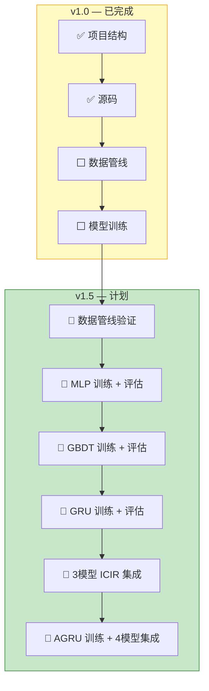

### 演进步骤

| 步骤 | 内容 | 预期产出 |
|------|------|----------|
| 1 | 运行 `feature_engine.py` + `preprocess.py` | 验证 180维特征 + VWAP标签正确性 |
| 2 | 单次训练 MLP | 基准 RankIC/ICIR |
| 3 | 单次训练 GBDT | 对比 MLP vs GBDT |
| 4 | 单次训练 GRU | 对比截面 vs 时序 |
| 5 | 3模型 ICIR 集成 | 验证集成提升 |
| 6 | 训练 AGRU | 4模型完整集成 |
| 7 | 滚动训练 (6窗口) | 论文完整复现 |
| 8 | 超参调优 | 基于 hypothesis-driven-hyperparameter-tuning SKILL |

---

## 10. 文件依赖图

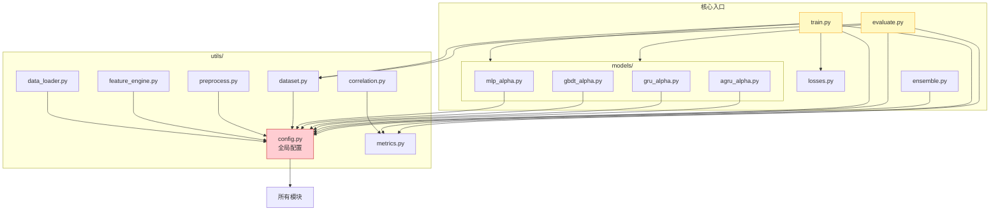

**依赖规则**：
- `config.py` 被所有模块依赖，但自身无依赖
- `utils/` 模块之间相互独立（除 `correlation.py` 引用 `metrics.py`）
- `models/` 只依赖 `config.py`，不依赖 `utils/`
- `train.py` 和 `evaluate.py` 是所有模块的编排层

---

## 11. 已知问题 / TODO

| 严重度 | 问题 | 影响 | 计划 |
|--------|------|------|------|
| 🔴 | 股票仅25只（Alpha数据不完整→路线B实际使用25只） | 180维特征参数/样本比≈2.2，过拟合风险 | P2 — 扩大股票池到200-500只 |
| 🟡 | GBDT在所有路线中均失败（Val IC=-0.0245~-0.0376） | z-score标准化破坏树模型分割能力 | P2 — 改用Rank标准化或不标准化 |
| 🟡 | GRU/AGRU在W4/W5窗口预测坍缩为常数 | 2022年极端行情下时序模型失效 | 观察项 |
| 🟡 | ICIR集成在路线B中无效（所有模型信号弱） | 无"锚"模型时集成反而拖累 | 观察项（路线A中集成有效） |
| 🟢 | correlation.py 中 max_ic_correlation 用自身做 IC | 函数不可直接使用 | P3 — 需要真实标签值 |
| 🟢 | 无指数增强策略 / 无风格中性化 | 面试缺少指增部分 | 需凸优化求解器+8个风格因子 |

---

## 12. 附录

### A. 完整目录结构

```
Project-Alpha-02/
├── GUIDE.md                 # CB编程上下文（内部文档，不入库）
├── DEVELOPMENT.md           # 本文档（开发文档，入库）
├── HANDOFF.md               # 交接文档（内部文档，不入库）
├── config.py                # 全局配置中心
├── train.py                 # 训练入口
├── evaluate.py              # 评估入口
├── ensemble.py              # ICIR加权集成
├── losses.py                # 损失函数
├── requirements.txt         # Python依赖
├── setup_env.bat            # 环境初始化
├── data/                    # 数据目录（不入库）
│   ├── raw/                 # price_data.csv (OHLC+VWAP+VOLUME)
│   └── processed/           # processed_data.csv (180维特征+label)
├── utils/
│   ├── __init__.py
│   ├── data_loader.py       # VWAP计算 + Alpha数据复用
│   ├── feature_engine.py    # 180维展开 + 序列构建 + VWAP标签
│   ├── preprocess.py        # MAD + zscore
│   ├── dataset.py           # CrossSectionDataset + SequenceDataset
│   ├── metrics.py           # RankIC/ICIR/分组回测
│   └── correlation.py       # 模型相关性
├── models/
│   ├── __init__.py
│   ├── mlp_alpha.py         # MLP (180→128→128→128→1)
│   ├── gbdt_alpha.py        # LightGBM
│   ├── gru_alpha.py         # GRU (2层, hidden=64)
│   └── agru_alpha.py        # AGRU (GRU+Self-Attention)
├── scripts/
│   ├── init_project.py      # 项目初始化
│   └── run_rolling.py       # 批量滚动训练
├── checkpoints/             # 模型保存（不入库）
├── logs/                    # 训练日志+评估图表（不入库）
└── notebooks/
    └── reproduction.ipynb   # 复现展示
```

### B. 快速启动命令

```bash
# 1. 环境初始化
setup_env.bat

# 2. 数据管线
python -m utils.data_loader       # 加载数据 + 计算VWAP
python -m utils.feature_engine    # 特征工程 + 序列构建
python -m utils.preprocess        # 预处理

# 3. 单模型训练
python train.py --mode single --model mlp
python train.py --mode single --model gbdt
python train.py --mode single --model gru
python train.py --mode single --model agru

# 4. 评估
python evaluate.py --model mlp
python evaluate.py --model gbdt

# 5. 滚动训练 (4模型×6窗口×3种子 = 72次训练)
python train.py --mode rolling
```

### C. 论文关键指标（参考基准）

| 指标 | MLP | GBDT | GRU | AGRU | 集成 |
|------|-----|------|-----|------|------|
| RankIC | 10.99% | 10.66% | 11.27% | 10.67% | **11.90%** |
| ICIR | 1.17 | 1.14 | 1.12 | 1.01 | **1.13** |
| 多头收益 | 33.23% | 29.84% | 31.28% | 24.53% | **33.11%** |

### D. 与 Project-Alpha 的复用关系

| Project-Alpha 模块 | Alpha-02 用途 | 修改点 |
|-------------------|------------------|--------|
| `utils/preprocess.py` | MAD+zscore+Label | Label 改为 VWAP 收益率，period=10 |
| `utils/dataset.py` | CrossSectionDataset | 输入维度 180 (非 11) |
| `models/mlp_alpha.py` | MLP 模型 | 3层128 (非 2层64)，Sigmoid 激活 |
| `losses.py` | MSE loss | 保留 IC/CCC 备用 |
| `utils/metrics.py` | RankIC/ICIR | 分组数 20 (非 5) |
| `data/raw/stock_data.csv` | 原始 OHLCV | 复用，VWAP=amount/volume |

### E. 关键技术决策记录

| 日期 | 决策 | 原因 |
|------|------|------|
| 2026-06-25 | 复用 Alpha 的 OHLCV 数据 | 股票池和时间范围一致，避免重复爬取 |
| 2026-06-25 | VWAP = amount/volume 近似 | AKShare VWAP 获取不稳定 |
| 2026-06-25 | 先跳过 AGRU | 论文显示 AGRU 不如 GRU，先验证核心管线 |
| 2026-06-25 | 简化版 50 只股票 | 适配 8GB VRAM，面试驱动 |
| 2026-06-25 | batch_size=1 截面模式 | 继承 Project-Alpha 验证过的模式 |
| 2026-06-25 | 跳过指数增强 + 风格中性化 | 需额外数据和求解器，优先级低 |
| 2026-06-28 | **项目定名为 Alpha-02** | Project-Alpha 的延续与扩展，非替代/迭代；原内部代号"Project-Beta"已废弃 |
